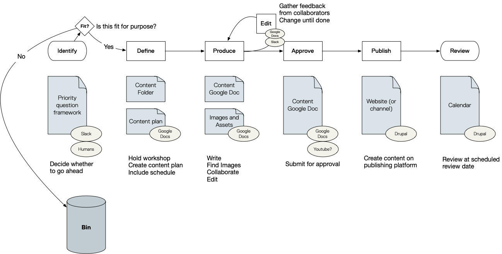
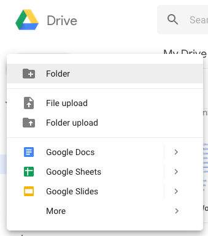
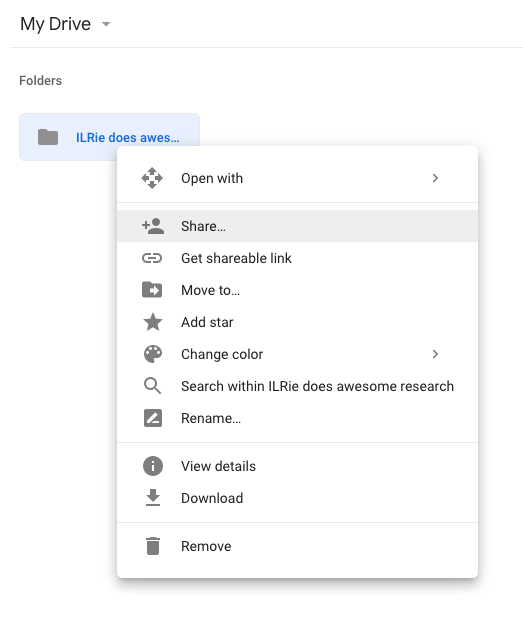

# Workflow

## Workflow outline

* **Setup Google Drive**
    - Create folder for new content
    - Share folder with the content team
* **Collaborate and plan**
    - Use the a priority framework
    - Make a content plan
* **Produce**
    - Create Google Doc in Google Drive folder
    - Create the content
    - Collaboratively edit with the production team
* **Approve**
    - Submit for approval
    - Let the approver know (Slack, Email) they need to approve the content
* **Publish**
    - Copy content to the appropriate channel (e.g. email template, ILR Website)
    - Publish
    - Celebrate
* **Review**

## Resources




## 1. Create a home for your new content

### 1.1 Set up Google Drive


Create a new folder in Google Drive


**Name your content, and create a folder for it on Google Drive.**

The very first step is to make sure there's a home for any content in Google Drive. Go into Google Drive and create a new folder. This is where all documents related to this content will live \(or be linked to, if they can't exist in Google Docs.\)

### 1.2 Share the Google Drive folder


Share the folder with the content team


**Share the folder with the right people.**

Choose your sharing options in Google Drive, and start listing the people you want to collaborate with by email address. If they don't show up automatically, make sure to put in the email address they use for Google Drive.


O_ptional: 'Get shareable link' in Google Drive, and share it with people via Slack._


## 2. Collaborate

Gather the right people together to quickly discuss what kind of content we can and should create.

### 2.1 *Optional*: hold a content-plan workshop


**Host a short workshop to create a content plan.**


Gather the right people together to quickly discuss what kind of content we can and should create. If you know about content you need to create in the near future \(such as the next sprint\), you can use a content-plan workshop to:

* **Collaborate across teams** \(and generate good ideas\)
* **Define the scope of the content**
  * Identifying what kind of content is needed
  * Planning where it'll live
  * Making sure it's covered by campaigns and social-media channels
  * Defining the team \(and what each person will do\)
  * Setting a date for publishing and reviewing 

You can also collaborate on a content plan via Slack once you've created the content-plan doc in Google Drive \(see below\).

### 2.2 Use a priority framework


**Use the priority framework to decide whether or not to make content**




We look at content from three perspectives to help us make decisions about it.

* **Audience** – who is our content for? 
* **Purpose** – to what end is it published? 
* **Process** – how do we create, publish, and curate our content?

To put our content into these contexts, we ask a series of questions.

### 2.3 Decide whether to go ahead


Apply the priorities \(i.e. decide to go ahead, wait, or stop making this content\)


If you decide as a team that this is not fit for purpose, do nothing further.

If you decide as a team that this content is worth doing in the near future, make sure it's shared with the right sprint teams to be included in their planning.

If you decide as a team that this _could_ work, but isn't for the near future, add it to an appropriate content backlog to review later.

### 2.4 Make a content plan


**Create a new doc in the Google Drive folder, name it "Content Plan."**



**Copy the text from the content plan template into your content plan.**






## 3. Produce

### 3.1 Create and edit


**Create a new doc in the Google Drive folder, name it the same as the folder.**


Collaboratively create and edit the document in Google Docs. 


**If appropriate, remember to use Google Drive's *Suggesting* feature to track changes.**


### 3.2 Source appropriate media


**Refer to the content plan for any image requirements.**



**Find appropriate images that illustrate the story, and that we're free to use.**


PAGE LINK TO NEW PAGE ABOUT IMAGES

### 3.3 Add media to Google Drive folder


**Add images, videos, and any other media used to the Google Drive folder**



**If appropriate, add images or links to where images should go in the Google Doc draft.**



**Create a new doc in the Google Drive folder, name it "Content Plan."**


## 4. Approve


**Submit the document for approval**


## 5 Content Quality

### 5.1 Images

* Aptness: "Does this image illustrate the story or does it emotionally engage with our intended audience?"
* Dimensions
* File name \(make sure it's descriptive like cookie\_day.jpg and not DSC02849.jpg\)
* File size
* Alt text \(for screen-readers\)
* Caption \(visible to readers\)

