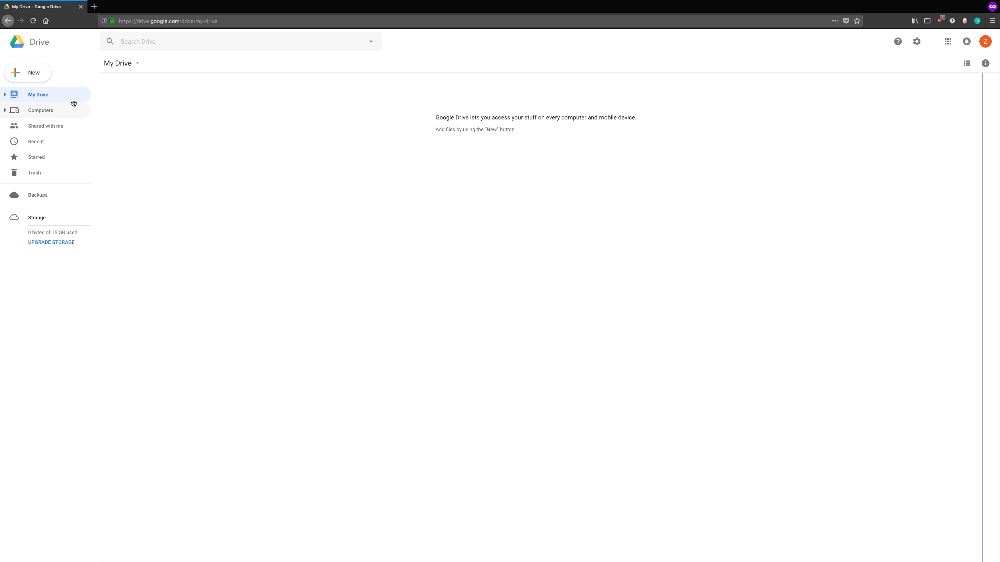

# Workflow

## 1. Identify Content Needs

### 1.1 Setup Google Drive


Create a new folder in Google Drive


**Name your content, and create a folder for it on Google Drive.**

The very first step is to make sure there's a home for any content in Google Drive. Go into Google Drive and create a new folder. This is where all documents related to this content will live \(or be linked to, if they can't exist in Google Docs.\)

### 1.2 Share the Google Drive folder


Share the folder with the content team


**Share the folder with the right people.**

Choose your sharing options in Google Drive, and start listing the people you want to collaborate with by email address. If they don't show up automatically, make sure to put in the email address they use for Google Drive.

_Optional: 'Get shareable link' in Google Drive, and share it with people via Slack._

## 2. Use a Priority Framework


Use the priority framework to decide whether or not to make content




We look at content from three perspectives to help us make decisions about it.

* **Audience** – who is our content for? 
* **Purpose** – to what end is it published? 
* **Process** – how do we create, publish, and curate our content?

To put our content into these contexts, we ask a series of questions.

### 2.1 Applying priorities


Apply the priorities \(i.e. decide to go ahead, wait, or stop making this content\)


If you decide as a team that this is not fit for purpose, do nothing further.

If you decide as a team that this content is worth doing in the near future, make sure it's shared with the right sprint teams to be included in their planning.

If you decide as a team that this _could_ work, but isn't for the near future, add it to an appropriate content backlog to review later.

## 3. Define purpose

### 3.1 Make a content plan


**Create a new doc in the Google Drive folder, name it "Content Plan."**



**Copy the text from the content plan template into your content plan.**






## 4. Outline content Requirements

Define the kind of content you want to create. This can be a page on a site, a printed postcard, a poster... anything that shares ILR's story and is fit for purpose.

### 4.1 Content types

Choose the right kinds of content to fit your purposes. You might need to create or commission several to accomplish your goals. Examples include:

* News story \(on the ILR website\)
  * Featured on home?
* Email campaign
* Social Media post \(or series\) 
  * Twitter
  * Instagram
  * Facebook
  * LinkedIn

## 5 Content Quality

### 5.1 Images

* Aptness: "Does this image illustrate the story or does it emotionally engage with our intended audience?"
* Dimensions
* File name \(make sure it's descriptive like cookie\_day.jpg and not DSC02849.jpg\)
* File size
* Alt text \(for screen-readers\)
* Caption \(visible to readers\)

